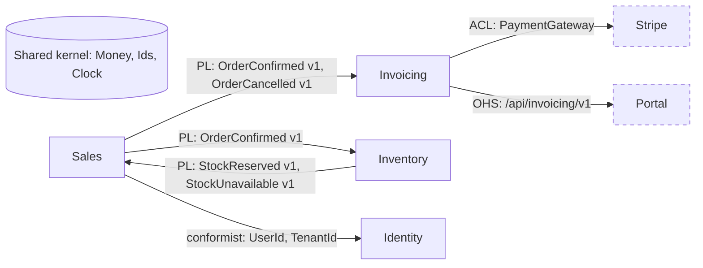

# Context mapping: patrones de relación entre contextos

## Índice

- [Para qué sirve el mapa](#para-qué-sirve-el-mapa)
- [Patrones de relación](#patrones-de-relación)
- [Cómo elegir el patrón](#cómo-elegir-el-patrón)
- [Cómo dibujar el mapa](#cómo-dibujar-el-mapa)
- [Ejemplo con cuatro contextos](#ejemplo-con-cuatro-contextos)
- [Patrones en código](#patrones-en-código)
- [Decisiones de equipo](#decisiones-de-equipo)
- [Errores frecuentes](#errores-frecuentes)
- [Checklist](#checklist)

Profundiza la tabla de relaciones de [overview](overview.md) §4. Requiere haber
identificado los contextos ([bounded-contexts](bounded-contexts.md)).

## Para qué sirve el mapa

El context map responde tres preguntas por cada par de contextos que se tocan:

1. **Dirección**: quién es upstream (su modelo influye) y quién downstream (se adapta).
2. **Mecanismo**: eventos, API síncrona, código compartido, lectura de datos.
3. **Poder**: qué pasa cuando el upstream cambia; quién paga la adaptación.

Sin mapa, la respuesta a "quién rompe si cambio esto" se descubre en producción.

## Patrones de relación

| Patrón | Dirección | Quién se adapta | Coste principal | Úsalo cuando |
|---|---|---|---|---|
| **Shared kernel** | ninguna (simétrica) | ambos, de común acuerdo | cada cambio exige acuerdo; tests compartidos | tipos universales y estables (`Money`, ids, `Clock`) |
| **Customer–Supplier** | U -> D con negociación | upstream prioriza necesidades del downstream | reuniones, backlog compartido, tests de contrato | dos equipos internos, el downstream tiene voz |
| **Conformist** | U -> D sin negociación | downstream adopta el modelo tal cual | vocabulario ajeno en tu dominio | upstream no negocia y su modelo es aceptable (Auth, Identity) |
| **Anti-Corruption Layer** | U -> D | downstream traduce | código de mapeo y su mantenimiento | upstream externo, legacy o inestable |
| **Open Host Service** | U -> muchos D | upstream mantiene API estable | versionado, compatibilidad hacia atrás | un contexto consumido por varios |
| **Published Language** | U -> muchos D | ambos sobre un esquema común | gobernanza del esquema, versionado de eventos | integración por eventos |
| **Separate ways** | ninguna | nadie | duplicación consciente | integrar cuesta más que duplicar |
| **Big ball of mud** | indefinida | nadie sabe | imprevisibilidad | etiqueta para legacy que aún no puedes cortar; se aísla con ACL |

**Partnership** (dos contextos que evolucionan juntos con release coordinado) existe en la
literatura; en la práctica de equipos pequeños se comporta como shared kernel o como
customer–supplier bidireccional. Evítalo salvo que ya lo tengas.

## Cómo elegir el patrón

Árbol de decisión, de arriba abajo:

```
¿El otro lado es externo (SaaS, proveedor, legacy sin dueño)?
  sí -> ACL siempre. Si además su modelo es idéntico al tuyo: conformist con ACL fino.
  no ->
¿Es código compartido (no un servicio) y cambia < 1 vez al trimestre?
  sí -> shared kernel, mínimo (VO técnicos, ids, contratos de eventos).
  no ->
¿Hay varios consumidores del mismo productor?
  sí -> open host service (API) o published language (eventos) + versionado.
  no ->
¿El consumidor puede influir en el roadmap del productor?
  sí -> customer–supplier. Formaliza con tests de contrato.
  no -> conformist (si el modelo vale) o ACL (si no).
¿La integración aporta menos de lo que cuesta?
  -> separate ways; documenta la duplicación.
```

Regla de agencia (de [overview](overview.md)): ACL con todo lo externo, eventos con
published language entre contextos propios, shared kernel diminuto.

## Cómo dibujar el mapa

Notación mínima, válida en Markdown, Mermaid o un tablero:

- Un nodo por contexto. Los externos con borde discontinuo.
- Una flecha por relación, de upstream a downstream, etiquetada con `patrón: mecanismo`.
- Marca U/D en los extremos cuando el patrón es asimétrico.
- Shared kernel como nodo aparte conectado sin flecha.



En texto plano (README):

```
[Sales]     --PL: OrderConfirmed v1-->      [Invoicing]
[Invoicing] --ACL: PaymentGateway-->        (Stripe)
[Identity]  --conformist: UserId-->         [Sales], [Invoicing]
{Shared kernel: Money, Currency, Clock}     usado por todos
```

Mantén el mapa en `senzu/arquitectura/context-map.md` y actualízalo en el mismo PR que añade o cambia
una integración. Un mapa desactualizado es peor que ninguno.

## Ejemplo con cuatro contextos

Producto: plataforma de reservas. Contextos: `Booking` (core), `Pricing`, `Billing`,
`Identity`. Externos: pasarela de pago y CRM.

| Relación | Patrón | Mecanismo | Justificación |
|---|---|---|---|
| Pricing -> Booking | customer–supplier | API interna `PricingApi::quote()` síncrona | Booking necesita precio para confirmar; el equipo de Pricing acepta requisitos de Booking |
| Booking -> Billing | published language | `BookingConfirmed v1`, `BookingCancelled v1` | Billing reacciona; no necesita bloquear la reserva |
| Identity -> todos | conformist | `UserId`, `TenantId` en shared kernel | Identity es estable y no negocia por contexto |
| Billing -> Pasarela | ACL | `PaymentGateway` + adaptador | el SDK cambia; su modelo no debe entrar en `Billing/Domain` |
| Booking -> CRM | ACL + separate ways parcial | exportación nocturna, no integración en línea | el CRM cambia de proveedor cada dos años |
| Billing -> Pricing | separate ways | Billing recibe importes cerrados en el evento | evita tarifar dos veces |

Observación: `Booking` es downstream de `Pricing` (síncrono) y upstream de `Billing`
(asíncrono). Un contexto core suele ser downstream de pocos y upstream de muchos.

## Patrones en código

### ACL: puerto + adaptador + traductor

```php
// Billing/Domain/PaymentGateway.php (puerto, vocabulario propio)
interface PaymentGateway
{
    public function charge(BillingAccountId $account, Money $amount, ChargeReference $ref): ChargeResult;
}

// Billing/Infrastructure/Stripe/StripePaymentGateway.php (el ACL)
final class StripePaymentGateway implements PaymentGateway
{
    public function charge(BillingAccountId $account, Money $amount, ChargeReference $ref): ChargeResult
    {
        $intent = $this->stripe->paymentIntents->create([
            'amount' => $amount->amountCents, 'currency' => strtolower($amount->currency),
            'customer' => $this->customerMap->stripeIdFor($account), 'metadata' => ['ref' => $ref->value],
        ]);
        return StripeChargeTranslator::toDomain($intent); // Stripe nunca sale de aquí
    }
}
```

### Published language: contrato de evento versionado

```ts
// shared-kernel/contracts/sales/OrderConfirmed.v1.ts
export interface OrderConfirmedV1 {
  readonly type: 'sales.order.confirmed';
  readonly version: 1;
  readonly orderId: string;
  readonly customerId: string;
  readonly lines: ReadonlyArray<{ sku: string; quantity: number; unitPriceCents: number }>;
  readonly currency: string;
  readonly occurredAt: string; // ISO-8601
}
```

Regla: campos solo se añaden (compatibilidad hacia atrás). Cambio incompatible = `v2`
publicado en paralelo durante un periodo de convivencia. Ver
[../tactical/domain-events.md](../tactical/domain-events.md).

### Customer–supplier: test de contrato en el consumidor

```python
# booking/tests/contract/test_pricing_api_contract.py
def test_quote_contract(pricing_api: PricingApi):
    quote = pricing_api.quote(QuoteRequest(listing_id="L1", nights=3, guests=2))
    assert quote.total.currency == "EUR"
    assert quote.total.amount_cents > 0
    assert quote.valid_until > datetime.now(UTC)
```

El test vive en el consumidor y corre contra el productor real en CI. Si Pricing cambia y
el test rompe, Pricing lo ve antes de mergear.

### Conformist: reexportar sin traducir

```ts
// sales/domain/ids.ts
export type { UserId, TenantId } from '@shared-kernel/identity';
```

Aceptas el tipo tal cual. Si un día necesitas traducir, conviertes este archivo en ACL sin
tocar el resto del dominio.

## Decisiones de equipo

Cada relación del mapa lleva un dueño y un acuerdo. Formato mínimo por relación:

```
Relación: Sales -> Invoicing (published language)
Contrato: OrderConfirmed v1 (schema en shared-kernel/contracts/sales)
Dueño del contrato: equipo Sales; cambios incompatibles con 1 sprint de aviso
Verificación: test de contrato en Invoicing, corre en CI de Sales
Escalado: si Invoicing no puede adaptarse, se mantiene v1 hasta acuerdo
```

Ritual recomendado: revisar el mapa cada trimestre o cuando entre un contexto nuevo.
Cambiar un patrón (p. ej. conformist -> ACL) es un ADR corto, no una discusión de pasillo.

## Errores frecuentes

- **Flechas sin dirección**: "Sales y Billing se integran" no dice quién cambia cuando
  algo rompe.
- **ACL que solo renombra campos**: si el adaptador copia el modelo externo uno a uno con
  otros nombres, no está traduciendo; el modelo externo sigue mandando.
- **Shared kernel con entidades de negocio**: `Customer` en `Shared/` es el monolito
  acoplado con carpeta nueva. Solo VO técnicos, ids y contratos de eventos.
- **Published language sin versión**: el primer cambio de campo rompe a todos los
  consumidores a la vez.
- **Customer–supplier sin tests de contrato**: la "negociación" es un mensaje de chat que
  nadie recuerda.
- **Conformist por pereza frente a SaaS**: el modelo de Stripe/HubSpot acaba en tu dominio
  y cambiar de proveedor es reescribir.
- **Mapa en una herramienta que nadie abre**: si no está en el repo, no existe.

## Checklist

- [ ] Existe `senzu/arquitectura/context-map.md` con un nodo por contexto y una flecha por integración.
- [ ] Cada flecha indica patrón, mecanismo y dirección upstream/downstream.
- [ ] Todo sistema externo se integra mediante ACL (puerto en dominio + adaptador).
- [ ] Los eventos entre contextos tienen contrato versionado en un lugar compartido.
- [ ] El shared kernel solo contiene VO técnicos, ids, `Clock` y contratos.
- [ ] Cada relación customer–supplier tiene test de contrato en CI del productor.
- [ ] Cada relación tiene dueño y regla de aviso para cambios incompatibles.
- [ ] El mapa se actualiza en el mismo PR que cambia una integración.
